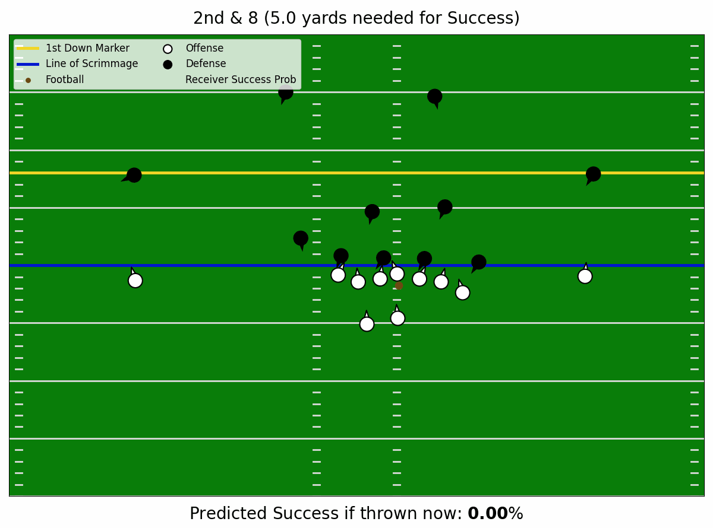
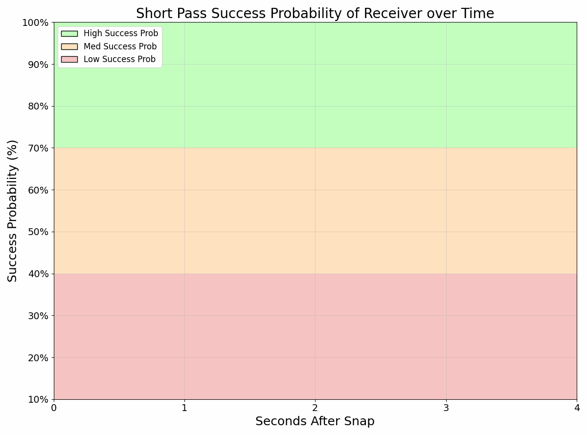
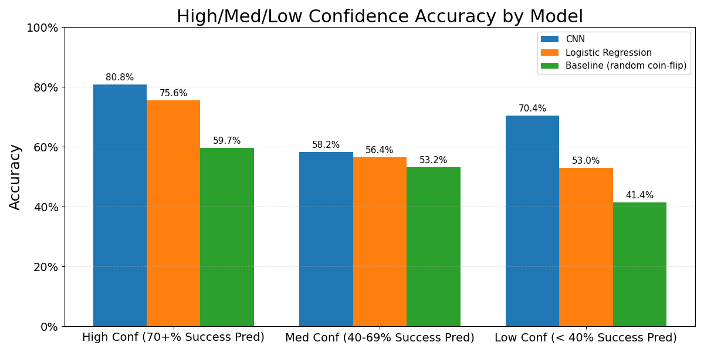
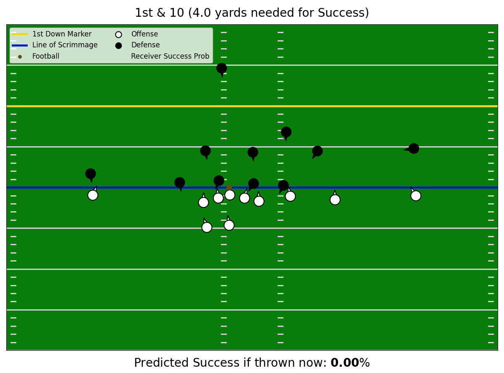
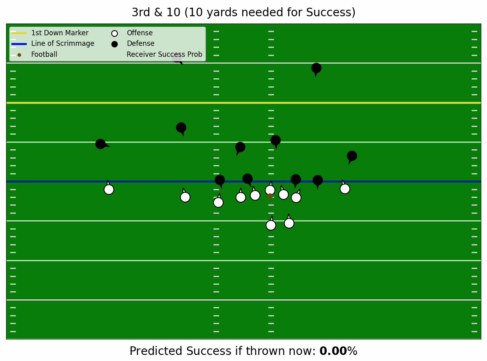

# Predicting NFL “Short Pass Success” with a CNN

This project uses **NFL player tracking data** to build a **CNN** that predicts, at every moment of a play, **the probability that a short pass to a receiver will succeed in meeting down-and-distance thresholds**, producing a clear “green/yellow/red-light” indicator for analyzing receivers and play design.

Play Visualization         |  Receiver Success Probability Visualization
:-------------------------:|:-------------------------:
  |  

**Author:** Louis DiMuro

[Read the Full Project Report](https://medium.com/@lou.j.dimuro/predicting-nfl-short-pass-success-with-a-cnn-2f279c985769)

[Demo of CNN predictions](https://nfl-short-pass-success-probability.streamlit.app/)

---

## Overview

- **Dataset:** 3,269 short pass plays from the 2021 (Weeks 1-8) and 2022 (Weeks 1–9) NFL seasons
- **Labels:** "Success" (59% class split) or "No Success" (41% class split), with "Success" defined as:
    - **40+%** of yards-to-go gained on **1st down**
    - **60+%** of yards-to-go gained on **2nd down**
    - **100%** of yards-to-go gained on **3rd/4th down**
- **Input:** 3,229 tensors of shape (13, 11, 10) (based on tensors from ["The Zoo"](https://www.kaggle.com/competitions/nfl-big-data-bowl-2020/writeups/the-zoo-1st-place-solution-the-zoo))
    - relative positional/velocity data between receiver and every defender
    - relative positional/velocity data between every pair of offensive/defensive-player
    - game-state (down & distance)
- **Model Results:**:
    - **PR-AUC**: 0.7929 (baseline=0.5941)
    - **80% accuracy** when success prediction ≥ 70%
    - **ROC-AUC**: 0.7314 (baseline=0.5)
    - **Brier score**: 0.2026 (baseline=0.2419)

---

## Model
- Input: (13, 11, 10) tensor (capturing positional/velocity of 22 players in a single frame of a play)
- ([Conv2D → BatchNorm → ReLU]x2 → SqueezeExcite → MaxPool → Linear → Sigmoid)
- Output: "Short Pass Success Probability" (SPSP) value between 0.0-1.0

## Training
- **Samples**: 3,229 (~40 reserved for the [Streamlit demo](https://nfl-short-pass-success-probability.streamlit.app/))
- **Cross‑validation**: 5‑fold stratified, repeated and averaged over 4 seeds
- **Epochs**: ~30–40 with early stopping
- **Optimizer**: Adam, weight_decay=1e-4
- **Scheduler**: OneCycleLR, max_lr=3e-4
- **Criterion**: BCEWithLogitsLoss, (weighted to account for class imbalance of success/no success samples)

---

## Results
The CNN performance was measured against a Logistic Regression model (using the flattened 13x11x10 tensors used for the CNN) and a random coin-flip baseline.

| Metric           | CNN           | LogReg   | Baseline (random coin-flip) |
|------------------|---------------|----------|-----------------------------|
| PR-AUC           | **0.7929**    | 0.6839   | 0.5941                      |
| ROC-AUC          | **0.7314**    | 0.6122   | 0.5000                      |
| Brier Score      | **0.2026**    | 0.2378   | 0.2419 (all preds=0.59)     |
| Overall Accuracy | **0.6808**    | 0.6030   | 0.5941                      |

---

## Visual Demo
[Demo of CNN predictions](https://nfl-short-pass-success-probability.streamlit.app/)

# "Success" Example

Play Visualization         |  Receiver Success Probability Visualization
:-------------------------:|:-------------------------:
  |  

# "No Success" Example

Play Visualization         |  Receiver Success Probability Visualization
:-------------------------:|:-------------------------:
  |  

---
# Applications/Use Cases
- **Receiver openness**: calculate the average SPSP for every play a receiver runs a short route, can answer the question “how often is this receiver getting open around the line of scrimmage?” The standard deviation of these SPSPs can also be used to determine how “consistent” a receiver gets open
- **Defensive formation vulnerability**: collect all SPSPs against a specific opponent and calculate the average SPSP for each defensive formation (e.g., Cover-3, 4-man front, etc.) to reveal which defensive formations and alignments are most susceptible to short passes
- **“Clutchness”**: count the number of times the SPSP predicted no success for a receiver’s play but the play ended up as a success, could potentially quantify the receiver’s ability to “turn nothing into something”
